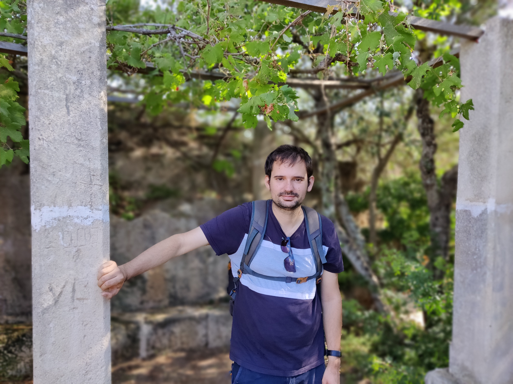

<h1 style="text-align:center;">Paco Torrenti's website</h1>

  

Welcome to my website! My name is Francisco Torrenti (akas Paco Torrenti)
and I am a theoretical physicist. I am currently a "Maria Zambrano" 
postdoctoral fellow at U. Valencia-IFIC. Previously, I was a postdoc at the U. Basel,
and a PhD candidate at the Institute of Theoretical Physics (Madrid).

My research is focused on the interface between cosmology and fundamental physics.
Most of my time, I try to understand what happened during the first instant
of the universe.

CosmoLattice...

You can perhaps ...